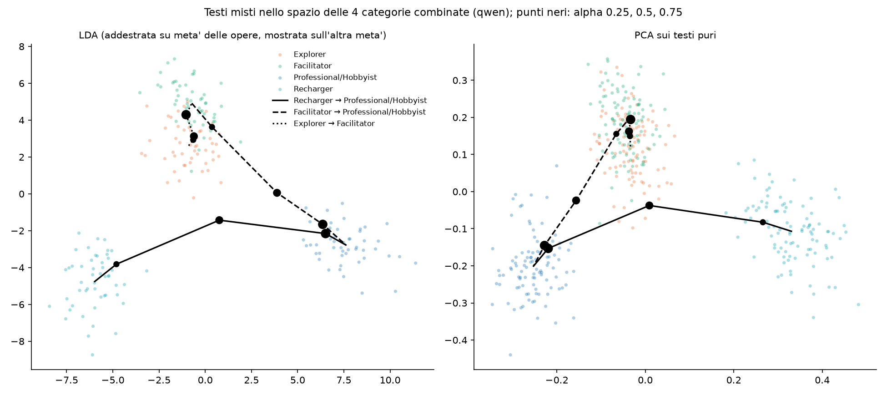
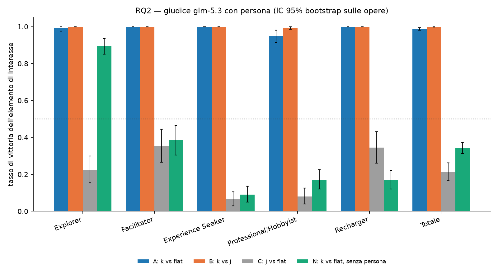
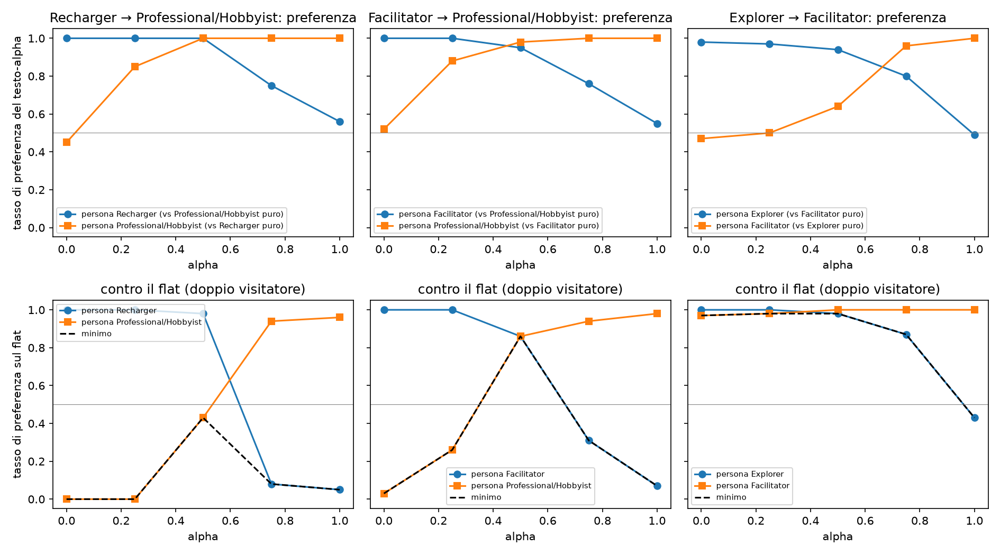
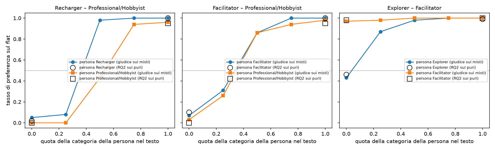

# Museumbot — parte 2: Gemma 4 31B e il profilo continuo

*Ultimo aggiornamento: 8 ottobre 2026. Il report descrive solo lo stato attuale del codice e
dei risultati; le decisioni nel tempo sono in `docs/decisioni.md`, la spec dell'esperimento
in `docs/plans/2026-10-06-profilo-continuo-design.md`. Numeri fra parentesi: embedding
BGE-M3 (fuori: Qwen3).*

**Domanda.** Con un modello aperto, Gemma 4 31B, di cui si controllano le distribuzioni sul
prossimo token, si possono generare testi *fra* due categorie di Falk, con un peso α. Il
report verifica che Gemma separi le categorie, poi chiede se i testi misti stanno davvero in
mezzo (RQ1) e se un giudice con persona li riconosce e li preferisce (RQ2).

## 1. Dati e pipeline

| passo | codice | output |
|---|---|---|
| testi puri | `generation/vllm_gen.py`, `kaggle/gen` | `data/local/generations.jsonl`: 600 `full` (5 categorie + flat) e 500 `full_rep` sulle 100 opere di `data/artworks.jsonl`, prompt di `common/prompts.py` più una riga contro il Markdown |
| testi misti | `generation/mixing.py`, `generation/vllm_mix.py`, `kaggle/mix-*` | `data/local/mixed.jsonl`: 940 testi, tre coppie × α = 0.25, 0.5, 0.75 × 100 opere più 60 del pilota |
| embedding | `rq1_embeddings/embed.py`, `mixed.py` | `data/emb/local/`, `data/emb/mixed/` |
| RQ1 | `analyze.py --corpus local`, `length.py`, `separation.py`, `mixed.py`, `mixed_space.py`, `generation/mix_diag.py` | `results/metrics_*_local.json`, `length_*`, `separation_*`, `mixed_*`, `mixed_space_*`, `mix_diag.json` |
| RQ2 | `rq2_judge/judge.py --corpus local`, `analyze.py --corpus local`, `mixed_judge.py`, `mixed_analyze.py`, `combined.py` | `data/judgments_local.jsonl`, `data/judgments_mixed.jsonl`, `results/judge_glm-5.3_local.json`, `judge_mixed_glm-5.3.json`, `judge_combined_glm-5.3.json` |
| esempi | `rq1_embeddings/mix_examples.py` | `docs/analisi/testi-misti-the-starry-night.{md,html}` |

Generatore: Gemma 4 31B QAT a 4 bit (`google/gemma-4-31B-it-qat-w4a16-ct`), vLLM 0.31.0 su
Kaggle (2× T4, float16, tensor parallel 2, patch al kernel di attenzione per le T4),
temperatura 0.7, ragionamento disattivato. Tutti i testi sono validi: 13 testi puri e 7
misti rimasti in violazione del filtro ("For those analyzing…", quasi sempre
Professional/Hobbyist) sono stati rigenerati in una seconda sessione con la stessa
configurazione.

## 2. Verifiche preliminari: Gemma separa le categorie?

Stessa batteria di analisi del report principale (§2) sui testi puri di Gemma, tutte e 6
le condizioni (`analyze.py --corpus local`, `results/metrics_*_local.json`).

**Lo shift c'è.** Probe a 6 classi 0.98 (0.975), caso 0.17; test di permutazione
p = 0.0005 (il minimo con 2 000 permutazioni) in entrambi gli embedding. La condizione
spiega il 12.5% (4.5%) della varianza.

| Qwen3 (BGE-M3) | Explorer | Facilitator | Exp. Seeker | Prof./Hobbyist | Recharger |
|---|---|---|---|---|---|
| split-half | 0.95 (0.87) | 0.96 (0.86) | 0.94 (0.91) | 0.93 (0.89) | 0.98 (0.96) |
| tetto (replica) | 0.99 (0.98) | 0.99 (0.97) | 0.99 (0.99) | 0.99 (0.99) | 1.00 (0.99) |

Le soglie della spec fissate prima dei dati sono superate (probe con p < 0.01, split-half
≥ 0.6 per ogni categoria).

**Lunghezza.** Il flat è molto più corto dei testi di categoria (mediana 178 parole contro
215–226), quindi ogni steering vector, preso rispetto al flat, contiene anche "più lungo
del flat". Lo shift però non è lunghezza (`rq1_embeddings/length.py`,
`results/length_*.json`): la lunghezza da sola, centrata per opera, dà un probe a 6 classi
di 0.35; togliendo dagli embedding la componente lineare della lunghezza, con il
coefficiente stimato a parità di opera e di categoria, il probe resta 0.99 (0.95),
p = 0.001, e ogni steering vector corretto ha coseno 0.97–0.99 (0.94–0.99) con
l'originale. Senza il flat il probe a 5 classi vale 1.00 (0.99).

**Separazione o formule?** Una separazione così netta può voler dire una personalizzazione
molto marcata o testi stereotipati (`rq1_embeddings/separation.py`,
`results/separation_*.json`). *Formule*: quota media dei trigrammi di parole di un testo
che compaiono in almeno il 10% dei testi della sua condizione. *Somiglianza sopra il flat*:
coseno medio fra testi della stessa condizione su opere diverse, meno lo stesso valore del
flat, che ha solo il contenuto dell'opera.

| condizione | formule | somiglianza sopra il flat |
|---|---|---|
| Explorer | 0.065 | +0.050 (+0.020) |
| Facilitator | 0.087 | +0.081 (+0.022) |
| Exp. Seeker | 0.090 | +0.056 (+0.038) |
| Prof./Hobbyist | 0.044 | −0.024 (−0.002) |
| Recharger | 0.157 | +0.151 (+0.096) |
| flat | 0.034 | +0.000 (+0.000) |

Il Recharger è la condizione più formulaica (0.157) e quella i cui testi si somigliano di
più fra opere diverse (+0.151 sopra il flat); il Professional/Hobbyist la meno formulaica.
Parte delle formule è propria del generatore, non della categoria: "take a moment" apre il
95% dei testi Facilitator, l'82% dei Recharger, il 76% degli Explorer e il 29% dei flat. La
separazione va quindi letta anche come stereotipia del registro.

## 3. RQ1 sulle categorie combinate

Verificata la separazione (§2), l'analisi si restringe alle quattro categorie che entrano
nelle coppie dei testi misti: Explorer, Facilitator, Professional/Hobbyist, Recharger.

**Probe a 4 classi** sui testi puri, centrati sulla media delle quattro categorie della
stessa opera e valutati fuori dal fold per opera (`rq1_embeddings/mixed_space.py`): 1.00
(0.99), caso 0.25.

**Coseni fra gli steering vector** (riferimento flat; `metrics_*_local.json`):

| coppia | coseno |
|---|---|
| Explorer – Facilitator | +0.79 (+0.69) |
| Explorer – Professional/Hobbyist | +0.02 (+0.15) |
| Explorer – Recharger | +0.48 (+0.52) |
| Facilitator – Professional/Hobbyist | −0.06 (+0.10) |
| Facilitator – Recharger | +0.39 (+0.39) |
| Professional/Hobbyist – Recharger | −0.07 (−0.04) |

Nessuna coppia è opposta: le più lontane (Professional/Hobbyist con Recharger e con
Facilitator) sono quasi ortogonali, la più vicina è Explorer–Facilitator. Lo split-half
delle quattro categorie va da 0.93 a 0.98 (0.86–0.96), il tetto dalla replica da 0.99 a
1.00 (0.97–0.99).

## 4. RQ1 sui testi misti

Passo 3 della spec. Un testo "fra" le categorie X e Y con peso α si genera con due esperti,
i prompt di X e di Y, e a ogni token si campiona dalla media dei loro logit con pesi
(1 − α, α), cioè dalla media geometrica pesata delle distribuzioni
(`generation/mixing.py`). Su vLLM la miscela si fa da fuori: a ogni passo una chiamata da
un token per esperto con le prime 100 log-probabilità, i token assenti dalla lista di un
esperto prendono il minimo della sua lista (`generation/vllm_mix.py`). Analisi in
`rq1_embeddings/mixed.py` (`results/mixed_{qwen,bge-m3}.json`): ogni testo, centrato sul
flat della sua opera, si proietta sul segmento fra gli steering vector v_X e v_Y del corpus
`local` (posizione 0 su X, 1 su Y), con il residuo fuori dal piano (v_X, v_Y) in rapporto
alla norma.

**Corpus misto** (`data/local/mixed.jsonl`, 940 testi, tutti validi): tre coppie scelte
prima dei dati, Recharger–Professional/Hobbyist e Facilitator–Professional/Hobbyist
(contrapposte) ed Explorer–Facilitator (vicine), α = 0.25, 0.5, 0.75 sulle 100 opere; più
60 testi del pilota (Recharger–Professional/Hobbyist, α = 0, 0.5, 1, prime 20 opere). I
vertici delle curve sono i testi puri del corpus `local`. 7 testi rimasti in violazione del
filtro sono stati rigenerati in una seconda sessione con la stessa configurazione.

**Verifica del metodo** (pilota): a α = 0 e 1, con un solo esperto, lo steering vector dei
testi passo per passo vale 1.00 e 1.00 (1.00 e 1.01) del tetto rispetto ai testi puri sulle
stesse opere. Il token scelto è fra le prime 100 di entrambi gli esperti nel 97.7–97.9%
(Recharger–Professional/Hobbyist), 98.8–99.5% (Facilitator–Professional/Hobbyist) e
99.5–100% (Explorer–Facilitator) dei passi.

**Posizione mediana per α**, Qwen3 (BGE-M3); α = 0 e 1 sono i testi puri:

| coppia | 0 | 0.25 | 0.5 | 0.75 | 1 | Spearman | segmento |
|---|---|---|---|---|---|---|---|
| Recharger → Prof./Hobbyist | 0.00 (−0.01) | 0.10 (0.14) | 0.54 (0.57) | 0.92 (0.94) | 0.99 (0.99) | 0.91 (0.90) | 0.59 (0.34) |
| Facilitator → Prof./Hobbyist | −0.02 (0.00) | 0.10 (0.25) | 0.57 (0.62) | 0.88 (0.86) | 0.99 (0.99) | 0.88 (0.88) | 0.46 (0.20) |
| Explorer → Facilitator | −0.01 (0.02) | 0.16 (0.25) | 0.30 (0.47) | 0.66 (0.75) | 0.98 (1.01) | 0.82 (0.77) | 0.22 (0.11) |

"Segmento" è |v_Y − v_X|. Il residuo resta fra 0.89 e 1.12 volte quello dei puri in tutte
le celle; le parole mediane fra 220 e 230.

- **Coppie contrapposte: risposta a soglia.** A α = 0.25 il testo resta vicino alla prima
  categoria, a 0.75 vicino alla seconda, il passaggio avviene intorno a 0.5. Tutte le
  soglie della spec sono superate in entrambi gli embedding.
- **Coppia vicina: risposta più graduale**, più vicina alla diagonale (con BGE-M3 0.25,
  0.47, 0.75), ma più rumorosa: il segmento è circa tre volte più corto, quindi la
  posizione dei singoli testi pesa più rumore (intervallo interquartile a α = 0.5:
  0.13–0.43 con Qwen3). Due soglie della spec non sono superate: la mediana a 0.5 con Qwen3
  (0.30, sotto 0.35) e lo Spearman con BGE-M3 (0.77, sotto 0.8).

**Come si alternano i due esperti nel testo** (`generation/mix_diag.py`,
`results/mix_diag.json`, testi a α = 0.5). Per ogni token il margine log p_X − log p_Y del
token scelto dice quale esperto lo preferiva; i token si raggruppano in frasi.

| | Rech.–Prof. | Fac.–Prof. | Expl.–Fac. |
|---|---|---|---|
| cambi di segno fra frasi consecutive (osservati / frasi mescolate) | 4.63 / 4.73 | 4.33 / 4.60 | 5.49 / 5.54 |
| dispersione dei margini per frase / tagli casuali | 1.08 | 1.00 | 1.12 |
| margine medio, ultimi tre decimi del testo | +0.32, +0.19, +0.36 | +0.03, +0.03, −0.05 | +0.06, +0.08, +0.20 |

Le frasi dello stesso esperto non si raggruppano in blocchi più che per caso, e i confini
di frase contano poco: i due registri si alternano in modo fine, senza sezioni. L'unica
tendenza di posizione è la chiusura: nel Recharger–Professional/Hobbyist la parte finale è
più Recharger, nell'Explorer–Facilitator l'ultimo decimo è più Explorer. Il margine vede
solo il token scelto, non le distribuzioni intere.

**I testi misti nello spazio delle quattro categorie** (`rq1_embeddings/mixed_space.py`,
`results/mixed_space_*.json`). Il probe a 4 classi addestrato sui puri (§3) classifica i
misti delle opere fuori dal suo fold; i misti si centrano con la media dei puri della loro
opera. Quota di testi assegnati alla prima categoria (X), alla seconda (Y) e alle altre due;
α = 0 e 1 sono i testi puri.

| coppia | α | X | Y | altra categoria |
|---|---|---|---|---|
| Recharger → Prof./Hobbyist | 0 | 1.00 (1.00) | 0.00 (0.00) | 0.00 / 0.00 |
| Recharger → Prof./Hobbyist | 0.25 | 0.99 (1.00) | 0.00 (0.00) | 0.01 / 0.00 |
| Recharger → Prof./Hobbyist | 0.5 | 0.32 (0.32) | 0.22 (0.48) | 0.46 (Explorer 0.45) / 0.20 (Explorer 0.11) |
| Recharger → Prof./Hobbyist | 0.75 | 0.00 (0.00) | 0.99 (1.00) | 0.01 / 0.00 |
| Recharger → Prof./Hobbyist | 1 | 0.00 (0.00) | 1.00 (1.00) | 0.00 / 0.00 |
| Facilitator → Prof./Hobbyist | 0 | 1.00 (0.98) | 0.00 (0.00) | 0.00 / 0.02 |
| Facilitator → Prof./Hobbyist | 0.25 | 0.88 (0.81) | 0.01 (0.09) | 0.11 (Explorer 0.11) / 0.10 (Explorer 0.10) |
| Facilitator → Prof./Hobbyist | 0.5 | 0.15 (0.09) | 0.71 (0.90) | 0.14 (Explorer 0.14) / 0.01 |
| Facilitator → Prof./Hobbyist | 0.75 | 0.00 (0.00) | 0.99 (1.00) | 0.01 / 0.00 |
| Facilitator → Prof./Hobbyist | 1 | 0.00 (0.00) | 1.00 (1.00) | 0.00 / 0.00 |
| Explorer → Facilitator | 0 | 1.00 (0.99) | 0.00 (0.01) | 0.00 / 0.00 |
| Explorer → Facilitator | 0.25 | 0.97 (0.81) | 0.03 (0.17) | 0.00 / 0.02 |
| Explorer → Facilitator | 0.5 | 0.82 (0.54) | 0.18 (0.45) | 0.00 / 0.01 |
| Explorer → Facilitator | 0.75 | 0.18 (0.19) | 0.82 (0.81) | 0.00 / 0.00 |
| Explorer → Facilitator | 1 | 0.00 (0.02) | 1.00 (0.98) | 0.00 / 0.00 |

- Nelle coppie contrapposte la classe passa da X a Y fra 0.25 e 0.75 quasi senza
  intermedi (0.99–1.00 da una parte o dall'altra), come la posizione sul segmento.
- **A α = 0.5 il misto Recharger–Professional/Hobbyist esce dalla coppia**: con Qwen3 il 45%
  dei testi è classificato Explorer, più che Recharger (32%) o Professional/Hobbyist (22%);
  con BGE-M3 il 20% va alle altre due categorie. Il testo a metà fra due registri lontani
  cade in una zona dello spazio che appartiene a un'altra categoria. Nel
  Facilitator–Professional/Hobbyist a 0.5 prevale già il Professional/Hobbyist (0.71, 0.90).
- Nella coppia vicina il passaggio è graduale (Explorer 0.97, 0.82, 0.18 con Qwen3; 0.81,
  0.54, 0.19 con BGE-M3) e nessun testo esce dalla coppia.

Le probabilità medie del probe sono morbide anche sui testi puri (0.39–0.80 sulla classe
giusta), per cui la quota di testi assegnati è la misura più leggibile.

Esempio completo per un'opera, con ogni token colorato dall'esperto che lo preferiva:
`docs/analisi/testi-misti-the-starry-night.md` (e `.html`).

## 5. RQ2 sui testi puri

Stesso disegno di RQ2 del report principale (§7: tipi A, B, C, N e controllo di attenzione,
entrambi gli ordini, stesso giudice GLM-5.3 e stesse persone) sui testi puri di Gemma
(`rq2_judge/judge.py --corpus local`, `analyze.py --corpus local`;
`data/judgments_local.jsonl`, `results/judge_glm-5.3_local.json`). 4200 giudizi, validi
100%, attenzione 100%, consistenza fra i due ordini
0.91, testo in posizione A scelto nel 51.2% dei casi.

| tipo | confronto | tasso (IC 95%) | per categoria: Expl. Fac. Exp.S. Prof. Rech. |
|---|---|---|---|
| A | persona k: testo k vs flat | 0.99 [0.98, 0.99] | 0.99 1.00 1.00 0.95 1.00 |
| B | persona k: testo k vs testo j | 1.00 [1.00, 1.00] | 1.00 1.00 1.00 0.99 1.00 |
| C | persona k: testo j vs flat | 0.21 [0.17, 0.26] | 0.23 0.35 0.07 0.08 0.34 |
| N | senza persona: testo k vs flat | 0.34 [0.31, 0.37] | 0.90 0.39 0.09 0.17 0.17 |
| A-C | specificità (A − C) | 0.77 [0.72, 0.82] | 0.77 0.65 0.94 0.87 0.66 |
| A-N | effetto della persona (A − N) | 0.65 [0.62, 0.67] | 0.10 0.61 0.91 0.78 0.83 |

- **Il giudice con persona preferisce il testo della propria categoria**: al flat nel
  98.8% dei casi, a quello di un'altra categoria nel 99.9%; con la persona sbagliata il
  testo personalizzato batte il flat solo nel 21.4%.
- **Senza persona il testo personalizzato batte il flat nel 34% dei casi**, quindi
  l'effetto della persona (A − N) è 0.65. L'eccezione è l'Explorer, preferito al flat
  anche dal giudice neutro (0.90).
- **Lunghezza**: a parità di tipo il testo più lungo è un po' favorito (logit
  +0.44 [+0.28, +0.68] per 30 parole), ma sulle coppie con lunghezze entro il 10% i
  tassi restano A 0.98, B 1.00, C 0.13, N 0.23.
- **Esplorative**: i testi più accettati dalle altre persone sono gli Explorer
  (0.57), i meno accettati i Recharger (0.015). L'accettazione dei testi altrui va con
  la geometria di RQ1: Spearman con il coseno fra gli steering vector +0.30 (Qwen3) e
  +0.64 (BGE-M3, p = 0.002), con la distanza -0.47 (-0.49).

## 6. RQ2 sui testi misti

Passo 4 della spec. Stesso giudice di RQ2 (GLM-5.3 su Ollama Cloud, stesse persone e
parametri), sulle tre coppie del passo 3 e le 100 opere, α = 0, 0.25, 0.5, 0.75, 1 con i
testi puri ai vertici (`rq2_judge/mixed_pairs.py`, `mixed_judge.py`, `mixed_analyze.py`;
`data/judgments_mixed.jsonl`, `results/judge_mixed_glm-5.3.json`). Nessuna persona mista:
si usano le persone pure e il giudice neutro. Un solo ordine A/B per confronto, bilanciato;
8 200 giudizi, tutti validi, attenzione 100%, testo in posizione A scelto nel 46.9% dei
casi.

- **Curva di preferenza**: la persona X sceglie fra il testo-α e il testo puro di Y (a α = 1
  il testo-α è la replica di Y, punto atteso 0.5); la persona Y il caso speculare.
- **Doppio visitatore**: ciascuna persona sceglie fra il testo-α e il flat; il minimo fra
  le due misura quanto un testo va bene a entrambe.
- **Ordinamento**: il giudice neutro riceve le definizioni di Falk delle due categorie e i
  5 testi in ordine casuale, e li ordina da "più per X" a "più per Y".
- **Coerenza**: il giudice neutro sceglie fra un testo misto e un testo puro quello che
  "suona come una voce sola".

| | Rech. → Prof. | Fac. → Prof. | Expl. → Fac. |
|---|---|---|---|
| persona X, testo-α preferito a Y puro (α = 0 … 1) | 1.00 1.00 1.00 0.75 0.56 | 1.00 1.00 0.95 0.76 0.55 | 0.98 0.97 0.94 0.80 0.49 |
| persona Y, testo-α preferito a X puro (α = 0 … 1) | 0.45 0.85 1.00 1.00 1.00 | 0.52 0.88 0.98 1.00 1.00 | 0.47 0.50 0.64 0.96 1.00 |
| Spearman α–preferenza (X / Y) | −0.89 / 0.89 | −0.98 / 0.98 | −1.00 / 1.00 |
| incrocio delle due curve | 0.50 | 0.45 | 0.66 |
| doppio visitatore: minimo fra le persone (α = 0 … 1) | 0.00 0.00 0.43 0.08 0.05 | 0.03 0.26 0.86 0.31 0.07 | 0.97 0.98 0.98 0.87 0.43 |
| ordinamento: Spearman mediano (ordini perfetti) | 1.00 (59%) | 1.00 (66%) | 0.90 (35%) |
| coerenza: misto scelto come "voce sola" | 0.52 | 0.57 | 0.58 |

- **Il giudice vede il gradiente.** Ordina i cinque testi quasi sempre nel verso di α
  (mediana 1.00 sulle coppie contrapposte, 0.90 sulla vicina) e le curve di preferenza sono
  monotone, con Spearman da 0.89 a 1.00 in valore assoluto.
- **Basta una traccia della propria categoria.** Ogni persona preferisce il testo-α al puro
  dell'altra categoria finché il testo contiene qualcosa della sua: la persona Recharger
  sceglie il testo a α = 0.75 nel 75% dei casi, la Professional/Hobbyist il testo a 0.25
  nell'85%.
- **Il testo a metà accontenta due visitatori diversi.** Contro il flat, nelle coppie
  contrapposte i testi puri piacciono a una sola delle due persone (minimo 0.00–0.08),
  il testo a α = 0.5 a entrambe: minimo 0.43 (Recharger–Professional/Hobbyist) e 0.86
  (Facilitator–Professional/Hobbyist). Nella coppia vicina tutti i testi piacciono a
  entrambe le persone fino a α = 0.5 (minimo 0.97–0.98): il test non distingue.
- **La miscela non costa coerenza**: il testo misto è scelto come "voce sola" nel 52–58%
  dei confronti con un testo puro.

Soglie della spec: le due coppie contrapposte le superano tutte. La coppia vicina non
supera l'incrocio (0.66, fuori da 0.4–0.6): la persona Facilitator preferisce il testo-α
all'Explorer puro solo da α = 0.75, quindi le due curve si incontrano tardi; il massimo
del doppio visitatore è interno (0.25, a pari merito con 0.5) ma la curva è quasi piatta.

## 7. RQ2: puri e misti insieme

Per la persona k mescolata con la categoria j, il tasso con cui k preferisce un testo al
flat in funzione della quota w della sua categoria nel testo (`rq2_judge/combined.py`,
`results/judge_combined_glm-5.3.json`). Ai vertici ci sono due stime indipendenti dello stesso
confronto: la RQ2 sui puri (§5; tipo A per w = 1, tipo C per w = 0, n = 200 e 50) e il
giudice sui misti (§6, n = 100); in mezzo solo il giudice sui misti.

| persona k | categoria j | w = 1 (puri / misti) | 0.75 | 0.5 | 0.25 | w = 0 (puri / misti) |
|---|---|---|---|---|---|---|
| Recharger | Prof./Hobbyist | 1.00 / 1.00 | 1.00 | 0.98 | 0.08 | 0.02 / 0.05 |
| Prof./Hobbyist | Recharger | 0.95 / 0.96 | 0.94 | 0.43 | 0.00 | 0.00 / 0.00 |
| Facilitator | Prof./Hobbyist | 1.00 / 1.00 | 1.00 | 0.86 | 0.31 | 0.10 / 0.07 |
| Prof./Hobbyist | Facilitator | 0.95 / 0.98 | 0.94 | 0.86 | 0.26 | 0.00 / 0.03 |
| Explorer | Facilitator | 0.99 / 1.00 | 1.00 | 0.98 | 0.87 | 0.46 / 0.43 |
| Facilitator | Explorer | 1.00 / 1.00 | 1.00 | 1.00 | 0.98 | 0.98 / 0.97 |

- **I due esperimenti concordano**: ai vertici le due stime differiscono al più di 0.03.
- **Per le coppie contrapposte la persona accetta il testo finché la sua categoria vi pesa
  almeno metà**: il Recharger preferisce al flat il testo con w = 0.5 nel 98% dei casi e
  quello con w = 0.25 nell'8%; il Professional/Hobbyist il testo con w = 0.5 nel 43%
  (con il Recharger) e nell'86% (con il Facilitator). La soglia è la stessa trovata negli
  embedding (§4).
- **Nella coppia vicina il Facilitator accetta tutti i testi** (0.97–1.00 anche senza la
  sua categoria), l'Explorer da w = 0.25 in su (0.87).

## 8. Limiti

Un solo generatore aperto, scelto senza confronto con altri, in float16 con una patch al
kernel di attenzione; una riga in più in coda al system prompt, contro il Markdown. Testi
molto formulaici (§2). La miscela è fatta da fuori con le prime 100 log-probabilità
(copertura 97.7–100%). Tre coppie di categorie; con Gemma nessuna coppia è opposta. Un solo
giudice, senza persone con bisogni misti; nei testi misti un solo ordine A/B per confronto.

## 9. Prossimi passi

1. Estensioni possibili: persona con bisogni misti a α = 0.5; altre opere in
   `docs/analisi/`; generalizzazione al generatore della parte 1 (DeepSeek, miscela passo
   per passo da fuori).
