# Museumbot — stato del progetto

*Ultimo aggiornamento: 8 ottobre 2026. Il report descrive solo lo stato attuale del codice e
dei risultati; le decisioni e le correzioni nel tempo sono in `docs/decisioni.md`.*

**Domanda di ricerca.** Quando un LLM genera un'audioguida "personalizzata" su una
categoria di visitatore di Falk, il testo cambia davvero, e in che direzione? Il paper di
riferimento (Dibitonto, Ferrato, Limongelli, Patroni, *Museum audio guides generation using
visitor categories and large language models*, Multimedia Systems 32:439, 2026) valuta le
audioguide con giudizio umano. Qui la domanda viene posta nello spazio latente: esiste, per
ogni categoria, uno **shift direzionale** misurabile e riproducibile rispetto a una
descrizione neutra?

**Risposta breve.** Sì. Con 100 opere e 6 condizioni, generate su un provider fisso, un
probe lineare distingue la condizione di generazione con accuracy del 95.3% (chance 16.7%),
le direzioni di shift rispetto al testo neutro sono stabili su metà disgiunte del corpus
(coseno 0.85–0.94) e il test di permutazione entro opera dà p = 0.0005. L'effetto è piccolo
in termini di varianza (6.5% contro il 73% spiegato dall'opera) ma è nitido, e le cinque
categorie non collassano fra loro.

**RQ2** (§7). Un giudice LLM (GLM-5.3) nei panni di una categoria preferisce il testo scritto
per quella categoria al flat nel 97% dei casi e a quello per un'altra categoria nel 99%;
senza persona, o con la persona sbagliata, preferisce invece il flat.

---

## 1. Pipeline

| passo | modulo (in `src/museumbot/`) | output |
|---|---|---|
| corpus | `corpus/fetch_artworks.py` | `data/artworks.jsonl` — 100 dipinti da Wikidata (15 grandi musei, filtro sui sitelink), con l'intro della voce Wikipedia inglese troncata su confine di frase (67–207 parole, mediana 135) |
| prompt | `common/prompts.py` | 6 condizioni: 5 categorie Falk + `flat` (nessun blocco categoria) |
| generazione, corpus principale | `generation/chain_study.py` | `data/main/chain_study.jsonl` — testi a prompt singolo `single_a` e `single_b` (500 + 500) e `flat` (100), più i 500 della chain (§5); DeepSeek V4 Flash su DeepInfra fp8, T = 0.7 |
| generazione, ablazione | `generation/generate.py` | `data/ablation/generations.jsonl` — corpus di settembre: 600 testi `full` + flat, 4 000 dell'ablazione (§6), 500 della replica `full_rep`; routing libero; usato solo per l'ablazione |
| generazione modello aperto (sviluppo) | `generation/vllm_gen.py`, `generation/local.py`, `kaggle/` | `data/local/generations.jsonl` — Gemma 4 31B QAT a 4 bit con vLLM su Kaggle (2× T4): 600 testi `full` (5 categorie + flat) e 500 `full_rep`, 100 opere, tutti validi (13 Professional/Hobbyist recuperati in una seconda sessione con la stessa configurazione, `kaggle/retry`), analisi in §8; `local.py` è il ciclo di miscela su MLX per le prove sul Mac |
| pulizia e corpus | `common/clean.py`, `common/corpus.py` | corpus `main` e `ablation`, testi puliti (sotto) |
| embedding | `rq1_embeddings/embed.py` | `data/emb/<corpus>/<modello>_<variante>.npy` (Qwen3-Embedding-0.6B, BGE-M3), locali, L2-normalizzati |
| analisi | `rq1_embeddings/analyze.py` | `results/metrics_{qwen,bge-m3}.json` + figure (corpus principale) |
| ablazione | `rq1_embeddings/ablation.py` | `results/ablation_{qwen,bge-m3}.json` + figure |
| chain vs singolo | `rq1_embeddings/chain_noise.py` | `results/chain_noise_{qwen,bge-m3}.json` (§5) |
| RQ2 | `rq2_judge/judge.py`, `rq2_judge/analyze.py` | `data/judgments.jsonl`, `results/judge_glm-5.3.json` + figura (§7) |
| esplorazione | `explore.py` | `data/explore.duckdb` (derivata, fuori da git): tabelle `artworks`, `prompts`, `texts`, `scores`, `judgments`; `build` la rigenera dai file sopra, `sql` interroga e stampa i testi per intero |

`scores` ha una riga per testo di categoria e modello di embedding: norma dello shift
rispetto al flat dell'opera, coseno con lo steering vector della propria categoria
(`cos_own`) e con quelli di tutte le categorie (`cos_<categoria>`), calcolati con le
funzioni di `analyze.py` sul corpus intero (riferimento flat). Serve a leggere i testi, non
produce risultati: i numeri del report vengono da `results/`.

Il corpus è sbilanciato sui musei (Orsay 27, Prado 26, NGA 14, Met 13, resto < 10): non è
un problema per l'analisi, che centra per opera, ma va detto se si riporta il dataset.

**Due corpus.** OpenRouter distribuisce DeepSeek V4 Flash su circa 15 provider, con
quantizzazioni diverse (fp4, fp8, non dichiarata) e comportamento diverso sul
ragionamento. Per questo:

- il **corpus principale** (`main`), su cui girano le analisi di §3 e RQ2, sono i testi a
  prompt singolo dello studio chain: tutti su DeepInfra fp8, con ragionamento attivato
  esplicitamente, provider registrato per riga e generati nella stessa sessione.
  `single_a` è la variante `full`, `single_b` la sua replica (`full_rep`), che dà il tetto
  di rumore; 140 testi su 1 100 hanno richiesto più di un tentativo;
- il **corpus di ablazione** (`ablation`) è quello di settembre, l'unico con le 8 varianti
  del blocco (§6). È stato generato con routing libero e senza registrare il provider: è
  una miscela non tracciata, ed è un limite da dichiarare. I suoi numeri non si
  confrontano direttamente con quelli del corpus principale.

`generate.py` salva il provider e i token di ragionamento di ogni risposta e accetta
`--provider` (es. `deepinfra/fp8`) per fissarlo senza fallback.

**Pulizia.** Tutti i testi passano per `common/clean.py`, sempre dal testo originale: toglie
il preambolo ("Here is the audio guide …"), i separatori, il markdown (anche i corsivi
lasciati aperti), i conteggi di parole, le intestazioni da copione e le didascalie di regia.
Il preambolo si toglie solo se è un'introduzione al testo (nomina la guida o il testo,
finisce con `:` o è seguito da `---`): righe come "Here is a painting that rewards a second
look." sono già descrizione e restano. Nel corpus di settembre la pulizia toglie 35
preamboli e il markdown di 3 382 testi su 4 600; nel corpus principale 5 preamboli e il
markdown di 847 testi su 1 100.

**Testi troncati.** 10 testi del corpus di settembre si interrompono a metà frase (8 hanno
esaurito i 2 000 token di output, ragionamento compreso). Cadono in 10 opere diverse, che
vengono escluse per intero da tutte le varianti dell'ablazione: restano 90 opere, e i
confronti fra varianti restano appaiati. Nel corpus principale nessun testo è troncato.

### 1.1 Il prompt singolo

Il paper usa una chain di 3 turni (1: "conosci le categorie di Falk?", 2: "riconosci i bisogni
di ciascuna?", 3: "scrivi l'audioguida per la categoria X"). Qui la chain è collassata in un
unico system prompt, inserendo come contenuto la risposta che GPT-4 aveva dato al turno 2
(Appendice A.1 del paper). Ogni blocco categoria ha la stessa forma in tre parti:

1. **definizione** della categoria (Tabella 1 del paper, Falk & Dierking);
2. **bisogno** ("Their need is …", da Appendice A.1);
3. **indicazione di stile** (da Appendice A.1).

Fra le condizioni cambia *solo* il blocco. Opera, fonte, vincoli, limite di parole e
decoding sono identici. Il prompt vieta riferimenti espliciti alla categoria ("For those",
"As a …"): un testo che li contiene viene rigenerato.

**Perché il prompt singolo** (direzione per la tesi). Il prompt singolo è
un'operazionalizzazione controllata della chain del paper, che ne conserva il contenuto.
Se la sostituzione cambi i testi lo verifica il §5, dopo i risultati di RQ1, perché usa gli
steering vector introdotti nel §2. Le ragioni della scelta, che valgono anche se la chain
desse testi più gradevoli:

1. **Controllo sperimentale.** Fra le condizioni cambia solo il blocco di categoria, quindi
   una differenza fra testi è attribuibile alla personalizzazione. Nella chain la
   descrizione delle categorie è scritta dal modello nei turni 1–2 e cambia con il modello.
2. **Fedeltà al contenuto del paper.** Il blocco usa la descrizione delle categorie
   pubblicata dagli autori (Tabella 1 e Appendice A.1), non quella che un modello diverso
   da GPT-4 riscrive da sé.
3. **Ancoraggio alla fonte.** Il prompt singolo chiede di usare solo il materiale fornito;
   il Prompt 3 della chain chiede "lesser-known facts" senza questo vincolo. In un museo un
   fatto non verificato è un rischio, e per RQ3 sarebbe un confondente: un visitatore
   potrebbe preferire un testo per un aneddoto in più, non per la personalizzazione.
4. **Scomponibilità.** Solo il prompt singolo permette l'ablazione in definizione, bisogno
   e stile (§6), che dice quale parte della personalizzazione agisce.
5. **Riproducibilità.** Un prompt fisso dà risultati confrontabili fra modelli; i turni
   intermedi di una chain dipendono dal modello che li genera.

L'argomento storico della chain (far richiamare al modello la tipologia di Falk passo per
passo) pesa meno con un modello attuale: con il solo nome della categoria il testo
conserva circa il 70% della direzione del blocco completo (§6.2).

## 2. Metodo di analisi

Il passaggio decisivo è il **centering per opera**. Nello spazio di embedding la varianza
dominante è *quale opera* si descrive, non *per chi*. Senza centering ogni proiezione mostra
100 cluster-opera e nessuna struttura di categoria. Si sottrae a ogni opera un riferimento,
e il riferimento dipende dalla domanda:

```
media:  e'[a,c] = e[a,c] − mean_c e[a,·]     tutte le condizioni trattate allo stesso modo
flat:   e'[a,c] = e[a,c] − e[a,flat]          effetto della categoria rispetto al neutro
v[c]    = mean_a e'[a,c]                      steering vector della categoria c
```

Gli **steering vector** sono presi rispetto al **flat**: rispondono a "quanto e in che
direzione la categoria sposta il testo rispetto alla descrizione neutra". Con la media, i 6
v[c] sommerebbero a zero per costruzione e i coseni fra categorie sarebbero spinti verso
−1/(C−1) = −0.2: un artefatto del riferimento, non un'opposizione fra categorie. Il flat è
l'origine e non ha un vettore proprio.

La **media** resta per le procedure che lavorano sul singolo testo con le etichette (probe,
permutazione, scomposizione della varianza): lì tutte le condizioni devono essere
scambiabili, e sottrarre un solo testo flat aggiungerebbe il suo rumore a ogni opera.

Le metriche, in ordine di forza probatoria:

1. **probe lineare** (logistica, GroupKFold per opera; riferimento media): lo shift è
   abbastanza preciso da riconoscere la condizione su opere mai viste?
2. **consistenza split-half** (riferimento flat): v[c] stimato su due metà disgiunte di
   opere ha la stessa direzione? Se sì, è una proprietà della categoria, non del campione.
   Le opere si dividono a caso in due metà da 50 per 200 volte; si riporta la media dei
   200 coseni.
3. **geometria**: la **distanza quadrata cross-validata** fra condizioni dice quali sono
   vicine e quali lontane; coseni e norme dei v[c] (riferimento flat) dicono in che
   direzione e di quanto ciascuna categoria sposta il testo.
4. **test di permutazione entro opera** (riferimento media): si permutano le etichette
   *dentro* ogni opera, così l'effetto-opera è preservato e il null è onesto.
5. **lunghezza e lessico**: confondenti da sorvegliare.

**Rumore di generazione e tetto.** Due generazioni dello stesso prompt danno testi diversi,
e quindi steering vector un po' diversi. Il **tetto** è il coseno fra gli steering vector
di due run indipendenti dello stesso prompt (nel corpus principale `single_a` e
`single_b`, con lo stesso flat):

```
tetto[c] = cos(v_A[c], v_B[c])
```

È il coseno massimo atteso fra due steering vector che hanno la stessa direzione vera:
quello che otterrebbe una copia esatta. Serve a **calibrare** i confronti fra steering
vector (§5, §6): un coseno osservato si legge come frazione del tetto, `cos / tetto`, e ≈ 1
vuol dire uguale a meno del rumore. Il tetto cambia da categoria a categoria (più basso
dove lo shift è più corto), quindi senza calibrazione due coseni grezzi di categorie
diverse non sarebbero confrontabili.

La distanza cross-validata è la crossnobis senza normalizzazione per la covarianza del
rumore (in 1024 dimensioni con 100 opere quella stima richiederebbe una regolarizzazione
difficile da giustificare):

```
d²[a,b] = (v¹[a] − v¹[b]) · (v²[a] − v²[b])     v¹, v² da metà disgiunte di opere
```

mediata su 200 divisioni. È imparziale: vale circa 0 se due condizioni non differiscono,
mentre la distanza semplice è sempre gonfiata dal rumore. Usa solo differenze fra
condizioni, quindi non dipende dal riferimento. È preferita a un probe binario per coppia,
che con un probe a 6 classi già al 95% darebbe quasi ovunque il 100% e non distinguerebbe
le coppie.

Le figure LDA sono addestrate su metà delle opere e proiettate sull'altra metà: senza questa
separazione la figura sovrastima grossolanamente la separabilità.

## 3. Risultati (corpus principale; embedding Qwen3, BGE-M3 fra parentesi)

### 3.1 Varianza

| sorgente | quota di varianza |
|---|---|
| opera | 73.3% (79.3%) |
| categoria | 6.5% (3.8%) |

L'effetto di categoria è un ordine di grandezza sotto l'effetto opera. È atteso, e giustifica
il centering.

### 3.2 Probe lineare

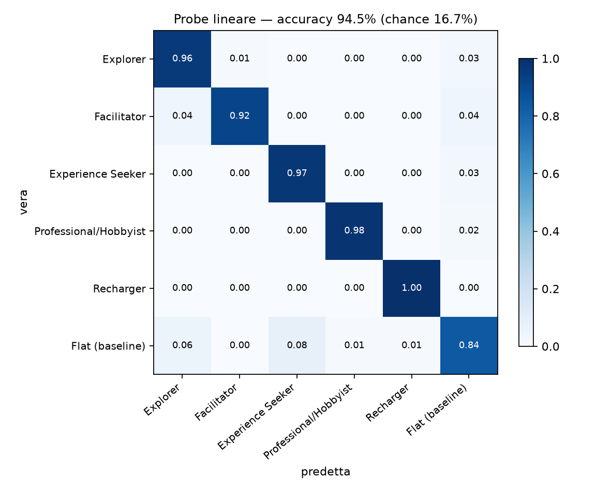

Accuracy **95.3%** (90.3%). Recall per classe:

| condizione | Qwen3 | BGE-M3 |
|---|---|---|
| Explorer | 0.97 | 0.94 |
| Facilitator | 0.95 | 0.86 |
| Experience Seeker | 0.98 | 1.00 |
| Professional/Hobbyist | 1.00 | 1.00 |
| Recharger | 1.00 | 1.00 |
| Flat (baseline) | 0.82 | 0.62 |

Le confusioni residue coinvolgono soprattutto il flat: è coerente, il flat non è una
categoria ma il punto da cui le categorie si allontanano.

### 3.3 Stabilità delle direzioni (split-half)

Coseno fra v[c] stimati su due metà disgiunte di 50 opere, riferimento flat: media ±
deviazione standard su 200 divisioni casuali. Il ± dice quanto il valore dipende da come si
dividono le opere; non è un intervallo di confidenza.

| condizione | Qwen3 | BGE-M3 |
|---|---|---|
| Explorer | 0.85 ± 0.02 | 0.79 ± 0.02 |
| Facilitator | 0.85 ± 0.02 | 0.65 ± 0.03 |
| Experience Seeker | 0.91 ± 0.01 | 0.87 ± 0.01 |
| Professional/Hobbyist | 0.93 ± 0.01 | 0.88 ± 0.01 |
| Recharger | 0.94 ± 0.01 | 0.93 ± 0.01 |

Le direzioni sono stabili. Explorer e Facilitator sono le due più deboli in entrambi gli
embedding: sono anche le due il cui blocco di prompt è più "generico" (curiosità, gruppo) e
meno prescrittivo sullo stile. Il punto debole è Facilitator su BGE-M3 (0.65): con quel
modello la sua direzione rispetto al neutro è poco riproducibile.

Con il riferimento media i valori sono più alti (Qwen3 0.89–0.96, BGE-M3 0.77–0.95), perché
la media di 6 testi è un riferimento meno rumoroso di un solo testo flat. Sono il limite
superiore dell'affidabilità della direzione; i valori sopra sono l'affidabilità degli
steering vector effettivamente riportati. Con il riferimento media si misura anche la
stabilità del flat stesso: 0.77 (0.66).

### 3.4 Riproducibilità fra generazioni (tetto)

Coseno fra gli steering vector di due generazioni indipendenti dello stesso prompt
(`single_a` e `single_b`, 100 opere; sezione `ceiling` di `results/metrics_*.json`).

| | Explorer | Facilitator | Exp. Seeker | Prof./Hobbyist | Recharger |
|---|---|---|---|---|---|
| Qwen3 | 0.957 | 0.958 | 0.980 | 0.985 | 0.990 |
| BGE-M3 | 0.937 | 0.905 | 0.973 | 0.977 | 0.985 |

È la prova di stabilità più forte: non divide le stesse generazioni in due metà, ma
rigenera tutti i testi da capo, e la direzione di ogni categoria torna quasi identica. I
valori sono più alti della split-half perché ogni stima usa 100 opere invece di 50. Sono
più bassi per Explorer e Facilitator, che hanno gli shift più corti (§3.5): a parità di
rumore, uno shift piccolo ne è disturbato di più. Questi valori sono il tetto usato per
calibrare il confronto con la chain (§5) e l'ablazione (§6).

### 3.5 Geometria

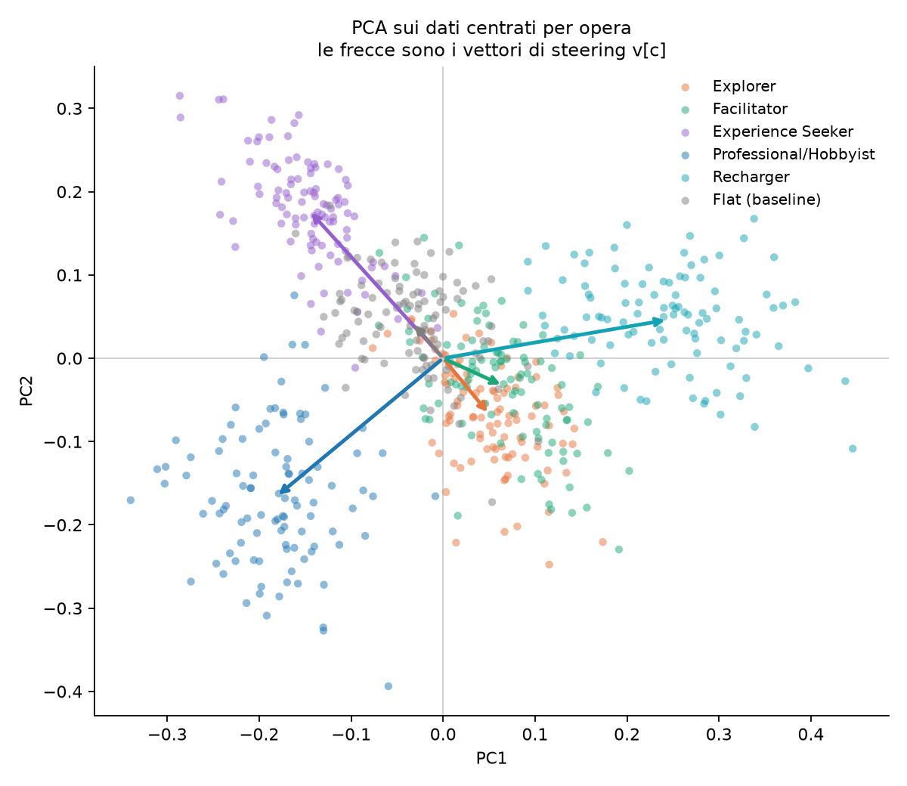

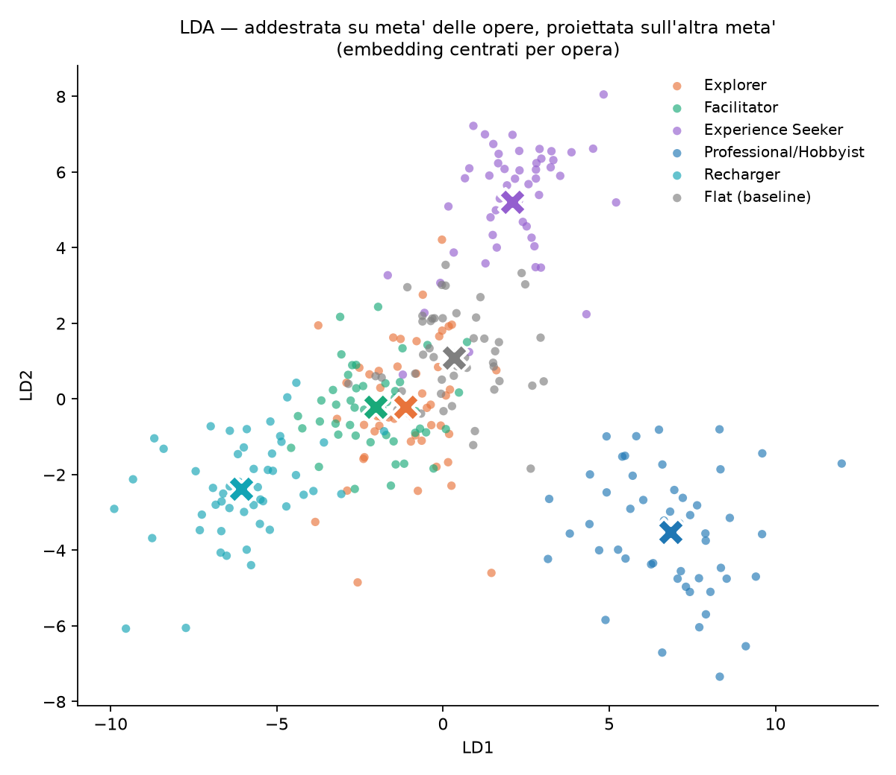

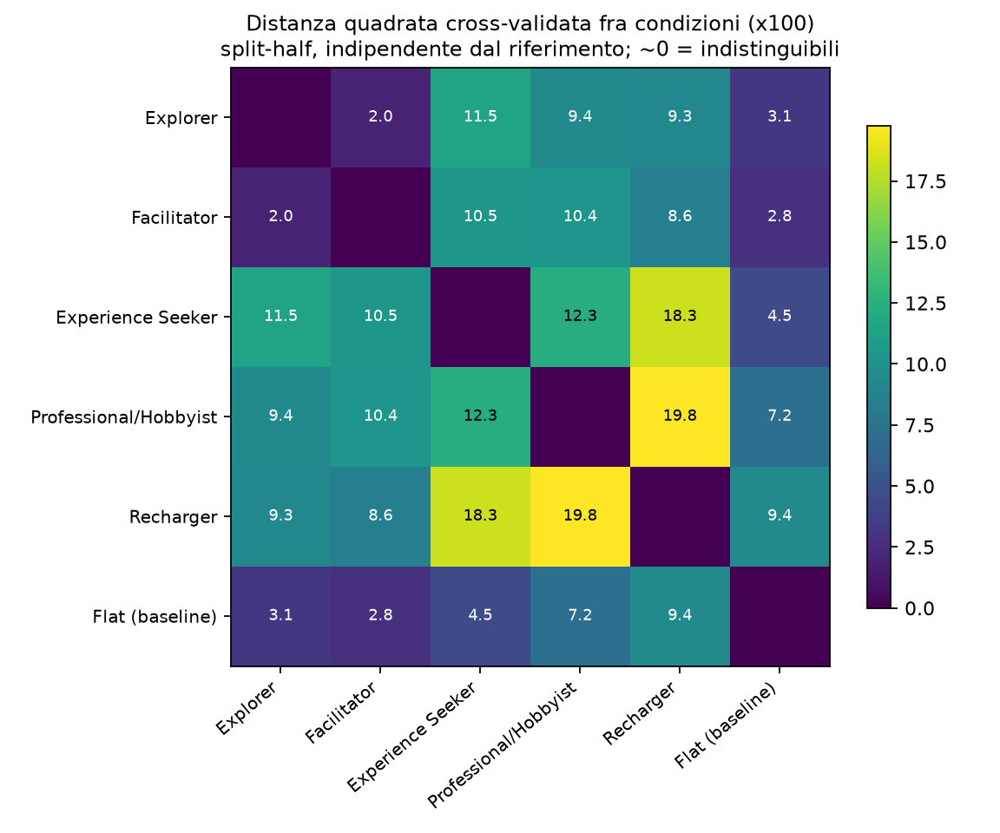

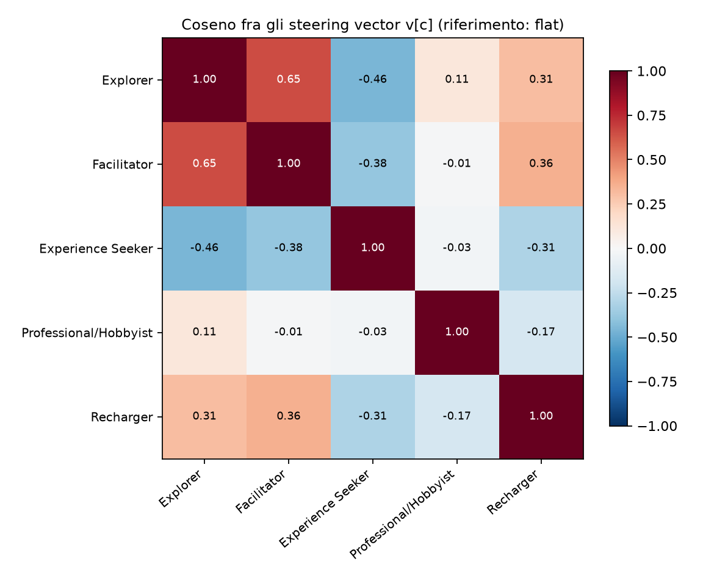

**Separazione (distanza cross-validata, ×100).** Le coppie più vicine sono Explorer–Facilitator
(2.0) e poi queste due con il flat (2.8 e 3.1). Le più lontane sono Professional/Hobbyist–
Recharger (19.8) ed Experience Seeker–Recharger (18.3). Nessuna distanza è vicina a zero: le
cinque categorie non collassano. Su BGE-M3 Facilitator è quasi sovrapposto al flat (0.6,
contro 1.0 per Explorer–Facilitator): coerente con la sua split-half bassa e con il recall
del flat al 62%.

**Ampiezza (norme dei v[c], rispetto al flat, Qwen3).** Recharger 0.31,
Professional/Hobbyist 0.27, Experience Seeker 0.22, Explorer 0.18, Facilitator 0.18. Lo
shift più forte è quello di Recharger e Professional/Hobbyist.

**Direzione (coseno fra i v[c], rispetto al flat).** Explorer e Facilitator spostano il
testo nella stessa direzione (+0.65; +0.51 su BGE-M3), e nella LDA e nella PCA i loro
cluster si sovrappongono: sono le due categorie che rischiano di collassare l'una
sull'altra. Anche Recharger condivide in parte quella direzione (+0.31 con Explorer, +0.36
con Facilitator). Le direzioni più opposte sono Explorer–Experience Seeker (−0.46):
"guarda più da vicino" vs "must-see", poi Facilitator–Experience Seeker (−0.38) ed
Experience Seeker–Recharger (−0.31). Professional/Hobbyist e Recharger sono la coppia più
distante, ma le loro direzioni sono solo moderatamente opposte (−0.17): la distanza viene
soprattutto dal fatto che sono i due shift più ampi.

### 3.6 Permutazione

Norma media osservata 0.188 contro null 0.040, **p = 0.0005** (2000 permutazioni entro opera).
Identico con BGE-M3 (0.123 vs 0.031).

### 3.7 Confondenti

**Lunghezza.** Professional/Hobbyist produce testi più lunghi (mediana 253 parole contro
218–236 delle altre condizioni). Lo shift non è lunghezza (`rq1_embeddings/length.py`,
`results/length_{qwen,bge-m3}.json`): la lunghezza da sola, centrata per opera, dà un probe
a 6 classi di 0.28 (caso 0.17); togliendo dagli embedding la componente lineare della
lunghezza, con il coefficiente stimato a parità di opera e di categoria, il probe resta
0.95 (0.92), il test di permutazione p = 0.001 e ogni steering vector corretto ha coseno
≥ 0.99 (≥ 0.98) con l'originale. Il probe senza il flat, a 5 classi, vale 0.99 (0.97).

**Lessico.** Le parole discriminative sono coerenti con i blocchi di prompt: Recharger
(*breathe, settle, slowly, breath, rest*), Facilitator (*discuss, talk, companions, group,
conversation*), Experience Seeker (*must, unforgettable, cornerstone, iconic*),
Professional/Hobbyist (*spatial, technically, compositional, glazes, scholarly*), Explorer
(*twist, discover, clue, closer*).
È una conferma, ma anche un avvertimento: parte dello shift potrebbe essere puro eco
lessicale delle istruzioni di stile, più che un cambio di registro. È esattamente la
domanda a cui risponde il passo successivo.

## 4. Conclusioni

- Il condizionamento sulla categoria Falk produce uno shift latente reale, riproducibile e
  specifico per categoria, robusto al modello di embedding.
- Le cinque categorie non collassano: quattro sono ben separate; Explorer e Facilitator
  sono le più vicine fra loro, le più vicine al flat e le più deboli, e spostano il testo
  in direzioni simili.
- Il flat si comporta come baseline: è il testo da cui le categorie si allontanano, e il
  probe lo confonde solo con le categorie a esso più vicine.
- I risultati valgono per il prompt singolo su provider fisso. La chain del paper produce
  testi diversi oltre il rumore e uno shift di categoria solo in parte uguale (§5).

## 5. Chain vs prompt singolo

**Domanda.** Collassare la chain del paper in un prompt singolo cambia i testi più di
quanto li cambi il rumore di generazione?

**Disegno** (`generation/chain_study.py`). Per ogni opera e categoria si generano tre testi
nella stessa sessione: due run indipendenti del prompt singolo (`single_a`, `single_b`) e
una della chain del paper (`chain`: turni 1–2 generati una volta e condivisi, come nel
paper, poi il Prompt 3 con la stessa fonte del singolo). Si aggiunge un testo `flat` per
opera, riferimento per gli steering vector. In totale 1 600 testi su DeepInfra fp8, con
ragionamento attivato esplicitamente; i job sono mescolati fra metodi, così nessun metodo
viene generato in un momento diverso dagli altri.

La chain apre sempre con una presentazione ("Here is a 250-word audio guide … for the
Recharger"), separata da `---`, usa markdown e in circa metà dei testi scrive in formato
copione: un'intestazione ("Audio Guide Script (approx. 250 words):", 240 testi su 500) e
didascalie di regia ("(Soft, inviting tone)", "(Fade out)"). La pulizia (§1) è applicata a
**tutti** i metodi: sulla chain toglie 498 preamboli su 500, sui singoli e sul flat quasi
solo il markdown; il testo originale resta nella riga.

**Analisi** (`rq1_embeddings/chain_noise.py`). Per ogni cella (opera, categoria):

```
within  = cos(S_a, S_b)                      rumore di generazione
between = ½ [cos(C, S_a) + cos(C, S_b)]      differenza fra metodi + rumore
R       = mean(1 − between) / mean(1 − within)
```

R ≈ 1 vuol dire che un testo della chain dista da un testo singolo quanto due testi singoli
fra loro. IC al 95% con bootstrap sulle opere. **Criterio, fissato prima di vedere i dati:
i due metodi sono equivalenti se il limite superiore dell'IC di R è sotto 1.10.** Assunzione:
la chain ha lo stesso rumore del singolo; se fosse più rumorosa l'eccesso verrebbe contato
come differenza, quindi un esito "equivalenti" è conservativo e un esito "non equivalenti"
va verificato con una seconda run della chain.

A livello di steering si confronta lo shift di categoria: `cos(v_C[c], v_S[c])` diviso per
il tetto `cos(v_Sa[c], v_Sb[c])` (§3.4). Tutti i testi del confronto vengono dalla stessa
sessione e dallo stesso provider.

**Risultati** (`results/chain_noise_{qwen,bge-m3}.json`; Qwen3, BGE-M3 fra parentesi).

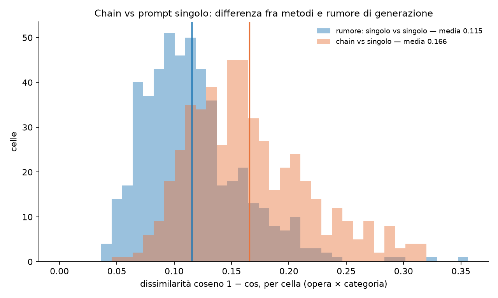

| | Qwen3 | BGE-M3 |
|---|---|---|
| cos singolo–singolo (rumore) | 0.885 | 0.920 |
| cos chain–singolo | 0.835 | 0.884 |
| **R** | **1.43** [1.39, 1.49] | **1.45** [1.40, 1.50] |

**I due metodi non sono equivalenti**: R supera la soglia di 1.10 con entrambi gli
embedding, e l'IC è lontano dalla soglia. Un testo della chain dista da un testo singolo
circa il 45% in più di quanto distino fra loro due testi singoli. R per categoria va da
1.26 (Explorer) a 1.63 (Professional/Hobbyist).

Anche lo shift di categoria cambia. Rapporto fra il coseno chain–singolo degli steering
vector e il tetto singolo–singolo (IC 95% bootstrap sulle opere):

| | tetto | chain / tetto | ‖v_chain‖ / ‖v_singolo‖ |
|---|---|---|---|
| Explorer | 0.96 (0.94) | 0.82 [0.75, 0.87] (0.89) | 0.93 (1.07) |
| Facilitator | 0.96 (0.91) | 0.71 [0.63, 0.79] (0.70) | 1.00 (1.66) |
| Experience Seeker | 0.98 (0.97) | 0.52 [0.45, 0.60] (0.69) | 0.74 (0.94) |
| Professional/Hobbyist | 0.99 (0.98) | 0.73 [0.69, 0.76] (0.77) | 0.79 (1.14) |
| Recharger | 0.99 (0.99) | 0.88 [0.85, 0.91] (0.94) | 0.94 (1.16) |
| media | | 0.73 (0.80) | |

La chain conserva la direzione di Recharger ed Explorer, molto meno quella di Experience
Seeker e Facilitator. I testi della chain sono un po' più lunghi (244 parole contro 236).

**Perché questo confronto** (direzione per la tesi). Non è un esperimento a sé ma il
controllo di validità del §1.1: la tesi sostituisce la chain del paper con un prompt
singolo, e prima di usarlo bisogna sapere se la sostituzione cambia i testi.

1. **Delimita la portata dei risultati.** Dice se le conclusioni di RQ1–RQ3 valgono anche
   per il metodo originale o solo per la sua versione a prompt singolo.
2. **Misura invece di giudicare a occhio.** Due run dello stesso prompt differiscono
   comunque; con due run del singolo nella stessa sessione e sullo stesso provider, la
   differenza fra metodi si confronta con il rumore, con un criterio di equivalenza
   fissato prima dei dati.
3. **Dice cosa cambia, non solo se cambia.** Il confronto sugli steering vector mostra in
   quali categorie la direzione della personalizzazione si sposta, e permette di cercarne
   la causa.
4. **Riproducibilità dei metodi a chain.** Rieseguita con un modello diverso, una chain non
   è lo stesso intervento: i turni intermedi, e con loro la descrizione delle categorie,
   dipendono dal modello. È un'avvertenza utile per chi riprende lavori di questo tipo con
   LLM più recenti.

In tesi va presentato come analisi di robustezza dell'operazionalizzazione, non come
correzione del metodo del paper.

**Come leggerlo.** I risultati di RQ1 valgono per il prompt singolo, non per la chain del
paper: le due implementazioni della stessa idea producono testi e shift di categoria
diversi (R = 1.43 / 1.45; direzione conservata fra 0.52 e 0.88 del tetto con Qwen3, fra
0.69 e 0.94 con BGE-M3). La causa più probabile è che nella chain il modello riformula da
sé la descrizione delle categorie: la sua risposta ai turni 1–2 descrive l'Experience
Seeker in termini di foto, dramma e meraviglia, il blocco del paper in termini di
importanza e status, ed Experience Seeker è la categoria la cui direzione cambia di più. Resta una riserva prevista dal disegno: se la chain fosse più rumorosa del
singolo, parte di R sarebbe rumore della chain e non differenza fra metodi. Una seconda run
della chain (`chain_rep`, 500 testi) la scioglierebbe; non è ancora stata generata.

`generation/compare_chain.py` resta come prova esplorativa (3 opere × 3 categorie, V4
Flash e V4 Pro, un testo per metodo): non ha un termine di confronto per il rumore e non va
usato come risultato.

## 6. Ablazione del prompt: quale parte del blocco produce lo shift?

Ogni blocco categoria è composto da tre parti in ordine fisso: **definizione** (chi è il
visitatore), **bisogno** ("Their need is …"), **stile** (come scrivere). L'ablazione genera
le stesse 500 audioguide (5 categorie × 100 opere) per 8 varianti del blocco: ogni parte
presente o assente, 2 × 2 × 2 combinazioni, fino alla variante in cui resta solo il nome
della categoria. Il flat non varia. Stesso modello, stessa
temperatura, stesso filtro sui riferimenti espliciti. Costo 0.45 $; rigenerazioni per
violazione del filtro 3.9%.

L'ablazione usa il corpus di settembre (routing libero, §1), pulito e senza le 10 opere con
testi troncati: **90 opere**. Il suo `full` è quello di settembre, non il corpus principale
di §3, quindi i valori assoluti delle due sezioni non si confrontano direttamente; dentro
l'ablazione tutte le varianti hanno lo stesso flat e le stesse opere.

| variante | def | need | style |
|---|---|---|---|
| `full` | ✓ | ✓ | ✓ |
| `no_def` | | ✓ | ✓ |
| `no_need` | ✓ | | ✓ |
| `no_style` | ✓ | ✓ | |
| `def_only` | ✓ | | |
| `need_only` | | ✓ | |
| `style_only` | | | ✓ |
| `name_only` | | | |

Per ogni variante: probe a 5 classi (flat escluso, è identico fra varianti), norma media
degli steering vector, **coseno con il full** per categoria (la metrica chiave: dice se la
parte conserva la *direzione* dello shift, non solo la separabilità), split-half e il
**coseno rispetto al tetto** di rumore (§3.4, §6.3). Gli
steering vector sono presi rispetto al flat, che è lo stesso testo in tutte le varianti:
il riferimento è quindi identico fra varianti. Con il riferimento media, invece, il
riferimento include le 5 categorie della variante e si sposta con essa, contaminando il
confronto con il full.

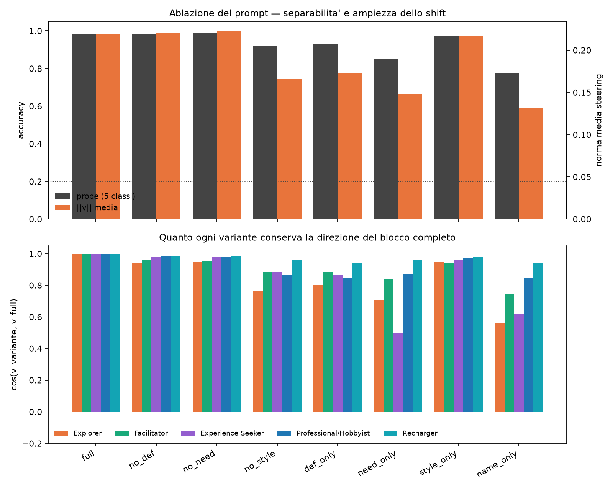

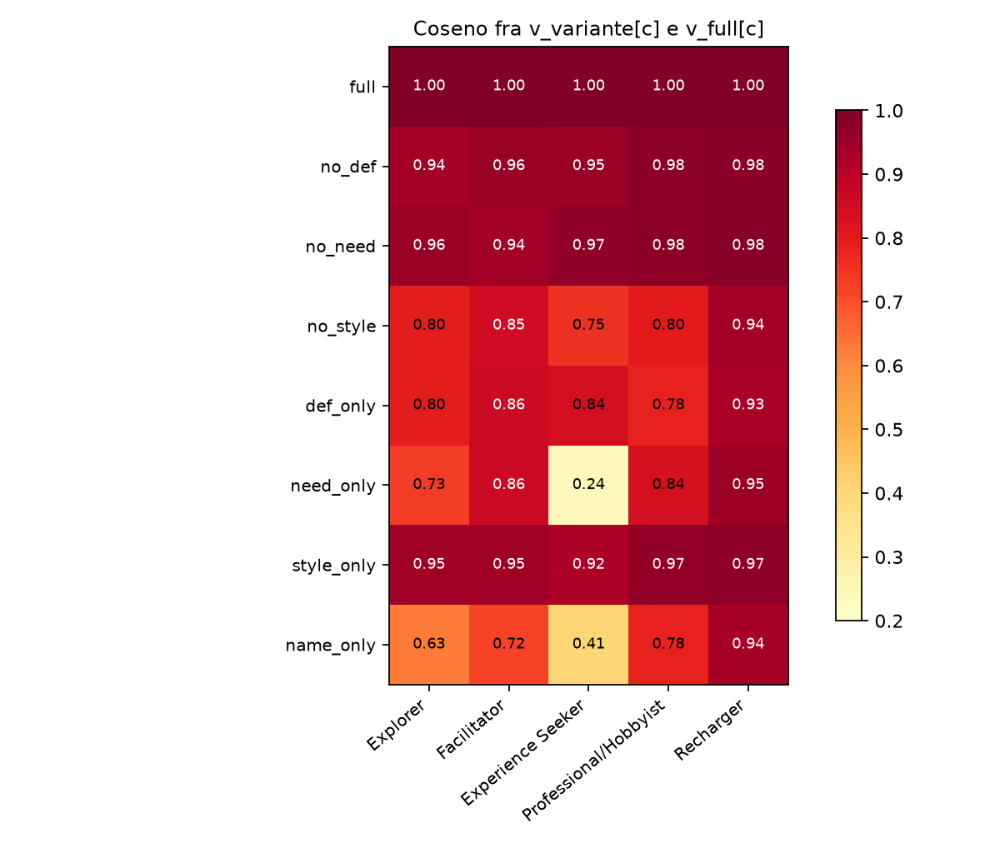

### 6.1 Risultati per variante (Qwen3; BGE-M3 fra parentesi)

Ordinate per coseno medio con il full. `cos/tetto` è il coseno con il full diviso per il
coseno fra due run del full sullo stesso provider (§3.4, §6.3).

| variante | probe 5 classi | ‖v‖ media | cos·full | cos/tetto | split-half |
|---|---|---|---|---|---|
| `full` | 98.2% (96.4%) | 0.232 (0.149) | 1.000 (1.000) | — | 0.87 (0.77) |
| `no_need` | 97.8% (95.8%) | 0.234 (0.149) | 0.966 (0.924) | 0.99 (0.97) | 0.87 (0.77) |
| `no_def` | 96.4% (95.3%) | 0.237 (0.148) | 0.962 (0.929) | 0.99 (0.97) | 0.88 (0.78) |
| `style_only` | 96.7% (95.1%) | 0.229 (0.143) | 0.951 (0.906) | 0.98 (0.95) | 0.87 (0.76) |
| `def_only` | 92.9% (90.0%) | 0.173 (0.122) | 0.841 (0.826) | 0.86 (0.86) | 0.78 (0.67) |
| `no_style` | 91.8% (89.1%) | 0.168 (0.122) | 0.828 (0.843) | 0.85 (0.88) | 0.76 (0.69) |
| `need_only` | 83.8% (86.0%) | 0.160 (0.112) | 0.724 (0.739) | 0.74 (0.77) | 0.75 (0.64) |
| `name_only` | 76.7% (73.1%) | 0.137 (0.100) | 0.695 (0.669) | 0.71 (0.70) | 0.60 (0.52) |

Chance del probe a 5 classi: 20%. La lunghezza media resta fra 229 e 241 parole per tutte
le varianti: l'ablazione non introduce un confondente di lunghezza.

### 6.2 Lettura

**Lo stile è la discriminante.** È sufficiente: da solo riproduce la direzione del blocco
completo (coseno 0.95 / 0.91) con la stessa ampiezza e la stessa separabilità. Ed è
necessaria: toglierlo è l'unica rimozione singola con un costo netto (0.83 / 0.84, e
la norma cala del 28% su Qwen3 e del 18% su BGE-M3).

**La definizione conta solo in assenza dello stile.** Aggiunta al solo nome, la definizione
porta il coseno da 0.70 a 0.84 (`name_only` → `def_only`; 0.67 → 0.83 su BGE-M3); aggiunta
allo stile, solo da 0.95 a 0.97 (`style_only` → `no_need`; 0.91 → 0.92). Le due parti dicono al
modello la stessa cosa e lo stile la dice in modo più operativo.

**Il bisogno da solo non basta, e in un caso devia.** `need_only` è la più debole delle
varianti a una parte, e per Experience Seeker il coseno crolla a 0.24 / 0.40: la frase
"Their need is memorable, high-impact takeaways", senza definizione né stile, spinge il
testo in una direzione quasi scorrelata da quella del blocco completo, e più debole (norma
ridotta del 42% / 40%). È l'unico caso in cui una
parte del prompt non è un sottoinsieme dell'effetto totale ma un effetto diverso.

**Il nome da solo conserva circa il 70% dello shift.** Con "Your listener is a
Recharger." e nient'altro, il probe resta al 77% / 73% contro il 20% di chance, e il
coseno medio è 0.70 / 0.67. Questa è la conoscenza parametrica di Falk del modello. Ma è
distribuita in modo molto diseguale: Recharger (0.94 / 0.94) e Professional/Hobbyist
(0.78 / 0.85) sono nomi autoesplicativi e il modello li interpreta come il blocco
completo; Explorer e Facilitator stanno nel mezzo (0.63 e 0.72 / 0.58 e 0.60); Experience
Seeker no (0.41 / 0.37), ed è anche il nome più ambiguo in inglese comune.

**Asimmetria fra categorie.** Recharger è robusto a ogni ablazione (coseno ≥ 0.93 in tutte
le varianti, ≥ 0.94 su BGE-M3): la sua direzione, quella contemplativa, è così marcata che qualunque indizio
basta a evocarla. Experience Seeker è la più fragile quando manca lo stile (`need_only`,
`name_only`): la sua direzione dipende dall'istruzione esplicita, non dal nome.

### 6.3 Calibrazione sul corpus di ablazione

Il tetto è quello del corpus principale (§3.4), applicato a un altro corpus: il tetto
proprio del corpus di settembre richiederebbe due run del full con la stessa miscela di
provider, che non è più riproducibile.

**Deriva di routing** (`routing_drift` in `results/ablation_*.json`). Sui singoli testi, la
dissimilarità fra `full` e `full_rep` del corpus di ablazione (provider misti, settembre
contro ottobre) è 1.16 [1.11, 1.21] (1.16 [1.11, 1.20]) volte quella fra due run sullo
stesso provider nel corpus principale, sulle 450 celle comuni: il routing libero sposta i
testi in modo misurabile. Dal corpus principale si usano solo i suoi coseni interni; i testi
dei due corpus non vengono confrontati fra loro. Per questo il tetto vero del corpus di
ablazione è un po' più basso di quello usato, e i rapporti sono conservativi.

Rapportate al tetto (colonna `cos/tetto` in §6.1), `no_def` e `no_need` valgono 0.99 con
Qwen3: togliere la definizione o il bisogno **non lascia traccia misurabile oltre al
rumore**. Con BGE-M3 valgono 0.97: una perdita piccola ma visibile. `style_only` è a 0.98
(0.95). Togliere lo stile costa il 15% su Qwen3 e il 12% su BGE-M3, `need_only` e
`name_only` circa un quarto.

### 6.4 Implicazione per il prompt

Per un sistema di produzione il blocco può ridursi all'istruzione di stile: stessa
efficacia, circa metà delle parole del blocco di categoria (il resto del system prompt non
cambia). Per lo studio scientifico l'ablazione dice che quello che
il paper chiama "adattamento alla categoria di Falk" è, nel modello, in larga parte
l'esecuzione di un'istruzione stilistica esplicita, e in misura minore l'evocazione di uno
stereotipo associato al nome. La definizione sociologica della categoria non aggiunge
nulla di misurabile quando lo stile è presente (al più il 3% con BGE-M3, §6.3).

## 7. RQ2: un giudice LLM con persona preferisce il testo personalizzato?

**Disegno** (`rq2_judge/`; spec e soglie in `docs/plans/2026-10-01-rq2-giudice-design.md`,
scritte prima dei giudizi). Il giudice è GLM-5.3 su Ollama Cloud (FP8; famiglia Zhipu,
diversa dal generatore), scelto con Judgemark v4. Confronto a coppie con scelta forzata
fra due audioguide della stessa opera, in entrambi gli ordini. La persona è il nome della
categoria più la sua definizione di Falk ("You are an Explorer: a curiosity-driven visitor
…"), senza bisogno né istruzioni di stile, che renderebbero il compito un riconoscimento
lessicale del prompt di generazione. Testi: corpus principale (`full` e flat).

| tipo | coppia | giudice |
|---|---|---|
| A | testo *k* vs flat | persona *k* |
| B | testo *k* vs testo *j* | persona *k* |
| C | testo *j* vs flat | persona *k* |
| N | testo *k* vs flat | senza persona |
| attenzione | flat dell'opera vs flat di un'altra opera | senza persona |

*j* ruota in modo bilanciato (ogni *j* 25 volte per ogni *k*) ed è lo stesso in B e C. In
tutto 4 200 giudizi, $5.32. Il ragionamento del giudice è al minimo (`reasoning_effort:
"low"`): con `"none"` Ollama riversa il ragionamento nella risposta invece di spegnerlo.
Il punteggio di una coppia è la media dei due ordini (1, 0.5 o 0), che neutralizza il bias
di posizione; IC al 95% con bootstrap sulle opere.

**Criteri di utilizzabilità** (fissati prima): risposte valide 100% (soglia 98%), controllo
di attenzione 100% (soglia 95%). Consistenza fra i due ordini 0.88; scelte "A" 53%.

**Risultati** (`results/judge_glm-5.3.json`): tasso di vittoria dell'elemento di interesse.

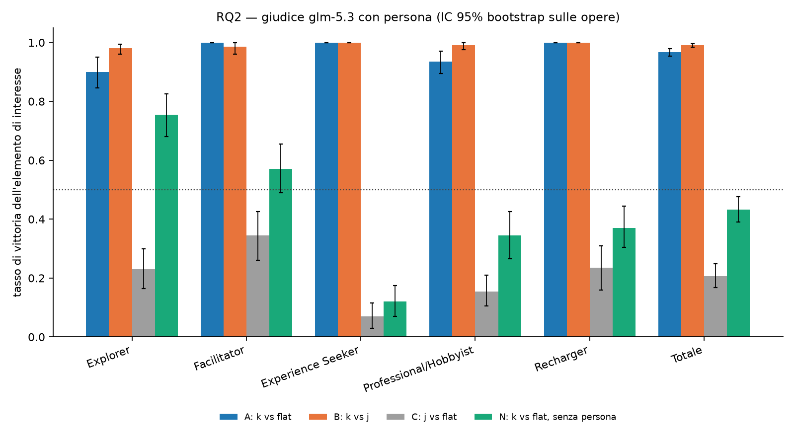

| | totale | Explorer | Facilitator | Exp. Seeker | Prof./Hobbyist | Recharger |
|---|---|---|---|---|---|---|
| **A** (*k* vs flat) | **0.967** [0.953, 0.979] | 0.90 | 1.00 | 1.00 | 0.94 | 1.00 |
| **B** (*k* vs *j*) | **0.991** [0.984, 0.996] | 0.98 | 0.98 | 1.00 | 0.99 | 1.00 |
| C (*j* vs flat) | 0.207 [0.167, 0.249] | 0.23 | 0.34 | 0.07 | 0.15 | 0.23 |
| N (senza persona) | 0.432 [0.390, 0.476] | 0.76 | 0.57 | 0.12 | 0.34 | 0.37 |
| **A − C** | **0.760** [0.718, 0.799] | 0.67 | 0.66 | 0.93 | 0.78 | 0.77 |
| **A − N** | **0.535** [0.495, 0.573] | 0.14 | 0.43 | 0.88 | 0.59 | 0.63 |

Nella riga N la categoria è quella del testo, non del giudice.

**Lettura.** Il giudice nei panni di *k* sceglie il testo per *k* quasi sempre, sia contro
il flat (A) sia contro il testo per un'altra categoria (B). La preferenza è specifica: con
la persona sbagliata il testo personalizzato perde contro il flat (C = 0.21), e senza
persona lo batte meno della metà delle volte (N = 0.43). Le motivazioni lo dicono in
chiaro: un Recharger scarta il testo Facilitator perché "prompts to discuss" rompono la
contemplazione; il giudice neutro preferisce il flat perché ha più contenuto storico-artistico.
Explorer è l'eccezione: il suo testo piace anche senza persona (N = 0.76), quindi A − N è
piccolo (0.14). Experience Seeker è il caso opposto: il suo tono "must-see" piace solo a lui
(N = 0.12, C = 0.07).

**Lunghezza.** A parità di tipo di coppia, il testo più lungo è un po' favorito (logit
+0.36 [+0.27, +0.51] per 30 parole), ma sulle sole coppie con lunghezze entro il 10% i
tassi non cambiano (A 0.96, B 0.99, C 0.19, N 0.41). Le motivazioni citano la lunghezza in
meno dell'1% dei casi.

### 7.1 Analisi esplorative

Decise dopo aver visto i risultati (sezione `exploratory` di `results/judge_glm-5.3.json`):
descrivono, non verificano ipotesi.

**Matrice di preferenza.** Per ogni persona (righe) e categoria del testo (colonne), quanto
spesso il testo batte il flat: diagonale dalle coppie A (100 per cella), fuori diagonale
dalle C (25 per cella).

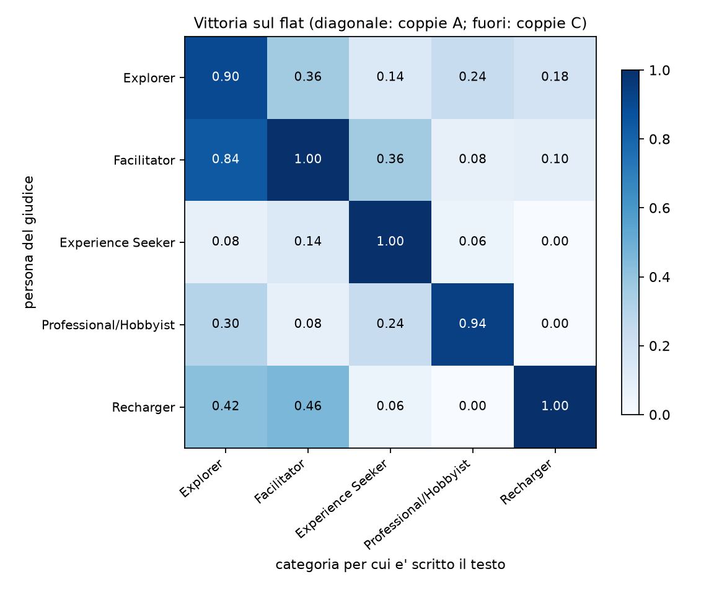

- **I testi più "trasferibili" sono Explorer e Facilitator.** Il testo Explorer batte il
  flat in media nel 41% dei casi quando lo giudica un'altra persona (Facilitator 0.84,
  Recharger 0.42, Professional/Hobbyist 0.30); Facilitator nel 26% (Recharger 0.46,
  Explorer 0.36). I testi Recharger (0.07) e Professional/Hobbyist (0.10) piacciono quasi
  solo alla propria persona: sono anche i due shift più ampi di RQ1 (§3.5).
- **Experience Seeker è la persona più esclusiva**: rifiuta ogni testo altrui (al massimo
  0.14) e il suo testo, senza persona, piace solo nel 12% dei casi (N, §7).
- **La confusione principale è Explorer ↔ Facilitator, ed è asimmetrica.** La persona
  Facilitator accetta il testo Explorer nell'84% dei casi; la persona Explorer accetta il
  testo Facilitator solo nel 36%. Nelle coppie B è anche l'unica confusione sopra il 5%:
  il Facilitator sceglie il testo Explorer al posto del proprio nel 6% delle coppie;
  tutte le altre sono al 4% o meno.

**Legame con RQ1.** L'accettazione dei testi altrui (le 20 celle fuori diagonale) segue la
geometria degli embedding: più due categorie sono vicine in RQ1, più la persona dell'una
accetta il testo dell'altra.

| | Spearman con la distanza cross-validata | Spearman con il coseno degli steering vector |
|---|---|---|
| Qwen3 | −0.79 (10 coppie: −0.90) | +0.55 (+0.72) |
| BGE-M3 | −0.68 (−0.66) | +0.79 (+0.95) |

Le 20 celle non sono indipendenti (distanza e coseno sono simmetrici), quindi la versione
su 10 coppie, che media i due versi, è quella da citare. È un collegamento fra le due RQ:
le categorie che il giudice confonde sono le stesse che gli embedding separano meno.

**Dove la persona non sceglie il proprio testo.** Solo Explorer (20 giudizi su 200 nelle
coppie A) e Professional/Hobbyist (13) perdono qualche volta contro il flat, quasi sempre
con un cambio di idea fra i due ordini. Le motivazioni dell'Explorer sono ricorrenti: il
flat "soddisfa la curiosità con informazioni concrete" invece che con "domande
retoriche". La persona, che riceve la definizione di Falk (curiosità e apprendimento),
interpreta la curiosità come voglia di fatti; il generatore, guidato dall'istruzione di
stile, la traduce in domande. È anche il motivo per cui A − N è piccolo per Explorer.

**Consistenza e posizione.** La consistenza fra i due ordini è alta quando la persona ha
una preferenza netta (A 0.96, B 0.99) e scende dove il compito è più ambiguo (C 0.84, N
0.74). Il bias di posizione è trascurabile con le persone (scelte "A" fra 50% e 53%) e
leggero senza persona (58%): la media dei due ordini lo neutralizza comunque.

**Motivazioni.** Quanto il giudice cita la propria categoria nella motivazione varia molto:
Experience Seeker 98%, Facilitator 96%, Recharger 62%, Explorer 32%,
Professional/Hobbyist 28%. Le due persone che citano di più il proprio nome sono anche
quelle con A = 1.00 e i nomi più "parlanti"; è un indizio, non una prova, del rischio di
corrispondenza fra persona e testo discusso sotto.

**Limiti.** Un solo giudice. La persona contiene la definizione di Falk, e il giudice cita
spesso il proprio nome ("As a Recharger…"): parte della preferenza può essere
corrispondenza fra la definizione e il testo, che i testi a loro volta riecheggiano.
Quanto queste preferenze coincidano con quelle di visitatori reali è la domanda di RQ3.

## 8. Sviluppo: lo shift di categoria su un modello aperto (Gemma 4 31B)

Passo 2 della spec `docs/plans/2026-10-06-profilo-continuo-design.md`: prima di generare
testi *fra* due categorie, verificare che il modello aperto che lo permette riproduca lo
shift di categoria. **Corpus `local`**: Gemma 4 31B QAT a 4 bit (vLLM su Kaggle, 2× T4), le
stesse 100 opere e gli stessi prompt del corpus principale più una riga contro il Markdown,
600 testi `full` e 500 della replica `full_rep`, tutti validi. Analisi di §2 con
`analyze.py --corpus local` (`results/metrics_{qwen,bge-m3}_local.json`) e confronto fra
generatori con `rq1_embeddings/cross_generator.py` (`results/cross_generator_*.json`).

**Lo shift c'è, ed è più netto che con DeepSeek.** Probe a 6 classi 0.98 (0.975), contro
0.95 (0.90) del corpus principale; test di permutazione p = 0.0005 (il minimo con 2 000
permutazioni) in entrambi gli embedding. La condizione spiega il 12.5% (4.5%) della
varianza, contro il 6.5% (3.8%).

| Qwen3 (BGE-M3) | Explorer | Facilitator | Exp. Seeker | Prof./Hobbyist | Recharger |
|---|---|---|---|---|---|
| split-half | 0.95 (0.87) | 0.96 (0.86) | 0.94 (0.91) | 0.93 (0.89) | 0.98 (0.96) |
| tetto (replica) | 0.99 (0.98) | 0.99 (0.97) | 0.99 (0.99) | 0.99 (0.99) | 1.00 (0.99) |
| cos con DeepSeek | 0.77 (0.71) | 0.87 (0.69) | 0.87 (0.77) | 0.87 (0.78) | 0.89 (0.87) |
| rapporto sui tetti | 0.80 (0.74) | 0.90 (0.74) | 0.89 (0.79) | 0.88 (0.79) | 0.90 (0.88) |

Il rapporto è `cos / sqrt(tetto_DeepSeek · tetto_Gemma)`: lo shift di Gemma punta nella
stessa direzione di quello di DeepSeek all'80–90% (74–88%) del massimo atteso dal rumore.
Tutte le soglie fissate nella spec prima dei dati sono superate (probe con p < 0.01,
split-half ≥ 0.6, rapporto ≥ 0.5).

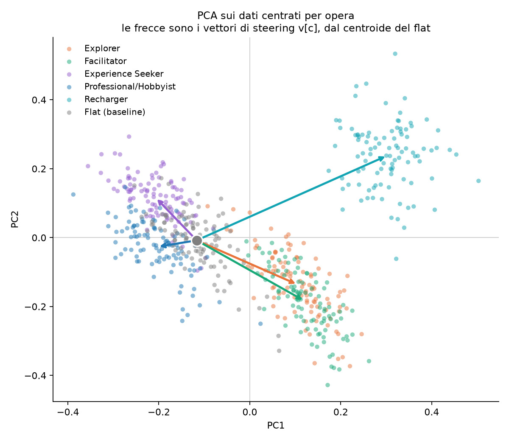

**Differenze rispetto a DeepSeek.** Gli steering vector sono più lunghi (Qwen3: Recharger
0.50 contro 0.31, Explorer 0.31 contro 0.18) e più simili fra loro: le coppie che con
DeepSeek erano opposte lo sono meno (Explorer–Experience Seeker −0.11 contro −0.46,
Recharger–Professional/Hobbyist −0.07 contro −0.17 con Qwen3). Una parte comune a tutte le
categorie è probabile: il flat di Gemma è molto più corto dei testi di categoria (mediana
178 parole contro 215–226; con DeepSeek 222 contro 234), quindi ogni steering vector
contiene anche "più lungo del flat". Lo shift però non è lunghezza (stessa analisi di
§3.7, `results/length_*.json`): la lunghezza da sola dà un probe di 0.35; togliendone la
componente dagli embedding il probe resta 0.99 (0.95), p = 0.001, ogni steering vector
corretto ha coseno ≥ 0.97 (≥ 0.94) con l'originale e il rapporto del coseno con DeepSeek
sui tetti, con entrambi i corpus corretti, resta 0.76–0.90 (0.73–0.89). Senza il flat il
probe a 5 classi vale 1.00 (0.99).

### 8.1 Testi a profilo misto

Passo 3 della spec. Un testo "fra" le categorie X e Y con peso α si genera con due esperti,
i prompt di X e di Y, e a ogni token si campiona dalla media dei loro logit con pesi
(1 − α, α), cioè dalla media geometrica pesata delle distribuzioni
(`generation/mixing.py`). Su vLLM la miscela si fa da fuori: a ogni passo una chiamata da
un token per esperto con le prime 100 log-probabilità, i token assenti dalla lista di un
esperto prendono il minimo della sua lista (`generation/vllm_mix.py`). Analisi in
`rq1_embeddings/mixed.py` (`results/mixed_{qwen,bge-m3}.json`): ogni testo, centrato sul
flat della sua opera, si proietta sul segmento fra gli steering vector v_X e v_Y del corpus
`local` (posizione 0 su X, 1 su Y), con il residuo fuori dal piano (v_X, v_Y) in rapporto
alla norma.

**Corpus misto** (`data/local/mixed.jsonl`, 940 testi, tutti validi): tre coppie scelte
prima dei dati, Recharger–Professional/Hobbyist e Facilitator–Professional/Hobbyist
(contrapposte) ed Explorer–Facilitator (vicine), α = 0.25, 0.5, 0.75 sulle 100 opere; più
60 testi del pilota (Recharger–Professional/Hobbyist, α = 0, 0.5, 1, prime 20 opere). I
vertici delle curve sono i testi puri del corpus `local`. 7 testi rimasti in violazione del
filtro sono stati rigenerati in una seconda sessione con la stessa configurazione.

**Verifica del metodo** (pilota): a α = 0 e 1, con un solo esperto, lo steering vector dei
testi passo per passo vale 1.00 e 1.00 (1.00 e 1.01) del tetto rispetto ai testi puri sulle
stesse opere. Il token scelto è fra le prime 100 di entrambi gli esperti nel 97.7–97.9%
(Recharger–Professional/Hobbyist), 98.8–99.5% (Facilitator–Professional/Hobbyist) e
99.5–100% (Explorer–Facilitator) dei passi.

**Posizione mediana per α**, Qwen3 (BGE-M3); α = 0 e 1 sono i testi puri:

| coppia | 0 | 0.25 | 0.5 | 0.75 | 1 | Spearman | segmento |
|---|---|---|---|---|---|---|---|
| Recharger → Prof./Hobbyist | 0.00 (−0.01) | 0.10 (0.14) | 0.54 (0.57) | 0.92 (0.94) | 0.99 (0.99) | 0.91 (0.90) | 0.59 (0.34) |
| Facilitator → Prof./Hobbyist | −0.02 (0.00) | 0.10 (0.25) | 0.57 (0.62) | 0.88 (0.86) | 0.99 (0.99) | 0.88 (0.88) | 0.46 (0.20) |
| Explorer → Facilitator | −0.01 (0.02) | 0.16 (0.25) | 0.30 (0.47) | 0.66 (0.75) | 0.98 (1.01) | 0.82 (0.77) | 0.22 (0.11) |

"Segmento" è |v_Y − v_X|. Il residuo resta fra 0.89 e 1.12 volte quello dei puri in tutte
le celle; le parole mediane fra 220 e 230.

- **Coppie contrapposte: risposta a soglia.** A α = 0.25 il testo resta vicino alla prima
  categoria, a 0.75 vicino alla seconda, il passaggio avviene intorno a 0.5. Tutte le
  soglie della spec sono superate in entrambi gli embedding.
- **Coppia vicina: risposta più graduale**, più vicina alla diagonale (con BGE-M3 0.25,
  0.47, 0.75), ma più rumorosa: il segmento è circa tre volte più corto, quindi la
  posizione dei singoli testi pesa più rumore (intervallo interquartile a α = 0.5:
  0.13–0.43 con Qwen3). Due soglie della spec non sono superate: la mediana a 0.5 con Qwen3
  (0.30, sotto 0.35) e lo Spearman con BGE-M3 (0.77, sotto 0.8).

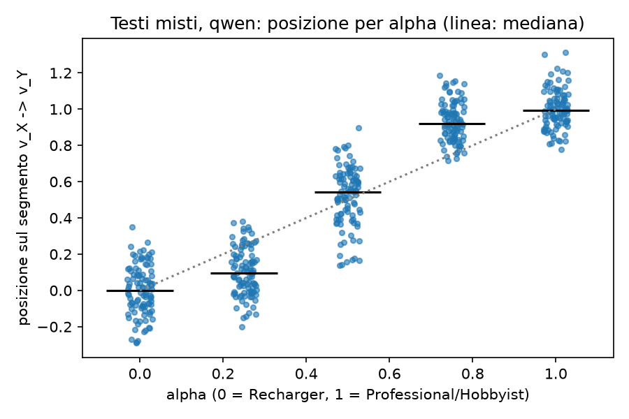

**Come si alternano i due esperti nel testo** (`generation/mix_diag.py`,
`results/mix_diag.json`, testi a α = 0.5). Per ogni token il margine log p_X − log p_Y del
token scelto dice quale esperto lo preferiva; i token si raggruppano in frasi.

| | Rech.–Prof. | Fac.–Prof. | Expl.–Fac. |
|---|---|---|---|
| cambi di segno fra frasi consecutive (osservati / frasi mescolate) | 4.63 / 4.73 | 4.33 / 4.60 | 5.49 / 5.54 |
| dispersione dei margini per frase / tagli casuali | 1.08 | 1.00 | 1.12 |
| margine medio, ultimi tre decimi del testo | +0.32, +0.19, +0.36 | +0.03, +0.03, −0.05 | +0.06, +0.08, +0.20 |

Le frasi dello stesso esperto non si raggruppano in blocchi più che per caso, e i confini
di frase contano poco: i due registri si alternano in modo fine, senza sezioni. L'unica
tendenza di posizione è la chiusura: nel Recharger–Professional/Hobbyist la parte finale è
più Recharger, nell'Explorer–Facilitator l'ultimo decimo è più Explorer. Il margine vede
solo il token scelto, non le distribuzioni intere.

## 9. Prossimi passi

1. Chain vs singolo: decidere se generare `chain_rep` per separare il rumore della chain
   dalla differenza fra metodi (§5).
2. RQ2: estensioni possibili (secondo giudice su un campione, persone ricavate dal
   dataset BIRD, compito di riconoscimento); scelta degli stimoli per RQ3.
3. RQ3: vedi `docs/plans/piano-progetto-tesi.md`.
4. Profilo continuo: giudice sui testi misti (passo 4). Spec in `docs/plans/2026-10-06-profilo-continuo-design.md`.

## Riferimenti

- Dibitonto M., Ferrato A., Limongelli C., Patroni O.C. (2026). Museum audio guides
  generation using visitor categories and large language models. *Multimedia Systems* 32:439.
- Zheng M. et al. (2024). When "A Helpful Assistant" Is Not Really Helpful: Personas in
  System Prompts Do Not Improve Performances of LLMs. *Findings of EMNLP 2024*.
  arXiv:2311.10054.
- Lutz M. et al. (2025). The Prompt Makes the Person(a): A Systematic Evaluation of
  Sociodemographic Persona Prompting for LLMs. *Findings of EMNLP 2025*. arXiv:2507.16076.
- Sclar M. et al. (2024). Quantifying Language Models' Sensitivity to Spurious Features in
  Prompt Design. *ICLR 2024*. arXiv:2310.11324.
- Chen R. et al. (2025). Persona Vectors: Monitoring and Controlling Character Traits in
  Language Models. arXiv:2507.21509.
- Rooein D. et al. (2023). Know your audience: Do LLMs adapt to different age and education
  levels? arXiv:2312.02065.
